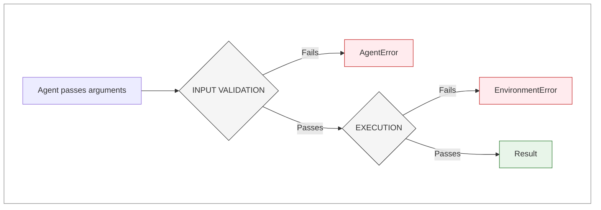

# Exception Handling

## Overview

When running benchmarks, tasks can fail for different reasons. MASEval provides an exception hierarchy that distinguishes between **agent failures** and **infrastructure failures**. This distinction gives you the option to analyze different failure modes separately, which can be useful for fair scoring or debugging.

!!! info "Why Distinguish Failure Types?"

    Consider a scenario where the agent provides correct inputs but the database connection times out. Without distinguishing failure types, this would appear as an agent failure. The exception hierarchy allows separating these cases when analysis requires it.

## Error Types

MASEval defines three error categories:

| Exception          | Source         | Default Scoring | Example                         |
| ------------------ | -------------- | --------------- | ------------------------------- |
| `AgentError`       | Agent input    | Included        | Agent passed wrong type to tool |
| `EnvironmentError` | Infrastructure | Excluded        | Database connection failed      |
| `UserError`        | User simulator | Excluded        | LLM API unreachable             |

### AgentError

Indicates the agent violated a contract at a controlled boundary:

```python
from maseval import AgentError

def calculate(a: int, b: int, operation: str) -> int:
    # Validate inputs
    if not isinstance(a, int):
        raise AgentError(
            f"Expected int for 'a', got {type(a).__name__}",
            component="calculate",
            suggestion="Provide a as an integer, e.g., a=10"
        )

    if operation not in ("add", "subtract", "multiply"):
        raise AgentError(
            f"Unknown operation: {operation}",
            component="calculate",
            suggestion="Use one of: add, subtract, multiply"
        )

    # ... execution logic
```

The optional `suggestion` field provides agent-friendly hints. Some agent frameworks use error messages for automatic retry attempts.

### EnvironmentError

Indicates infrastructure failure after input validation passed:

```python
from maseval import EnvironmentError

def fetch_data(query: str) -> dict:
    # Input validation passed, now execute
    try:
        return database.query(query)
    except DatabaseTimeoutError as e:
        raise EnvironmentError(
            "Database query timed out",
            component="fetch_data",
            details={"timeout": 30, "query_length": len(query)}
        ) from e
```

The `details` dict can include debugging information for developers.

### UserError

Indicates user simulation infrastructure failure:

```python
from maseval import UserError

class SimulatedUser:
    def respond(self, agent_message: str) -> str:
        try:
            return self.llm.generate(agent_message)
        except APIError as e:
            raise UserError(
                "User simulator LLM failed",
                component="user_simulator",
                details={"error": str(e)}
            ) from e
```

## The Boundary Pattern

One approach to exception handling places the boundary between agent responsibility and infrastructure responsibility at input validation:



With this pattern:

- Validation failures indicate agent-provided bad input (`AgentError`)
- Execution failures after validation indicate infrastructure issues (`EnvironmentError`)

## Validation Helpers

MASEval provides optional utilities for input validation:

```python
from maseval import (
    validate_argument_type,
    validate_required_arguments,
    validate_arguments_from_schema,
)

SCHEMA = {
    "properties": {
        "query": {"type": "string"},
        "limit": {"type": "integer"},
    },
    "required": ["query"],
}

def search(**kwargs):
    validate_arguments_from_schema(kwargs, SCHEMA, component="search")
    # Execution logic...
```

These helpers raise `AgentError` with automatic suggestions:

```
AgentError: [search] Argument 'limit' expected integer, got string.
Suggestion: Provide limit as an integer, e.g., 10
```

## Task Execution Status

Each completed task has a status indicating what happened:

| Status                    | Description                    |
| ------------------------- | ------------------------------ |
| `success`                 | Task completed normally        |
| `agent_error`             | AgentError was raised          |
| `environment_error`       | EnvironmentError was raised    |
| `user_error`              | UserError was raised           |
| `evaluation_failed`       | Evaluator raised an exception  |
| `setup_failed`            | Task setup raised an exception |
| `unknown_execution_error` | Unclassified exception         |

## Scoring Considerations

When computing benchmark metrics, distinguishing between failure modes, provides the option to exclude those infrastructure failures from the scoring.

The recommended use is to count `agent_error` as agentic failure and others as benchmarking failure, i.e include the former but exclude the letter from scoring.

```python
results = benchmark.run(tasks)
summary = compute_benchmark_metrics(results)
```

Example output:

```
Total Tasks: 100
Scored Tasks: 92
Success Rate: 65.22%

Status Breakdown:
  success                    60
  agent_error                 8
  environment_error           5
  user_error                  2
  ...
```

The success rate (65.22%) reflects `60 / 92` rather than `60 / 100`.

## Rerunning Failed Tasks

Infrastructure errors are often transient. Tasks with infrastructure failures can be rerun:

```python
results = benchmark.run(tasks)

# Identify infrastructure failures
infra_failed_ids = [
    r["task_id"] for r in results
    if r["status"] in ("environment_error", "user_error", "unknown_execution_error")
]

if infra_failed_ids:
    # Filter and rerun
    retry_tasks = tasks.filter(lambda t: t.id in infra_failed_ids)
    retry_results = benchmark.run(retry_tasks)

    # Merge results
    final_results = [
        r for r in results if r["task_id"] not in infra_failed_ids
    ] + retry_results
```

## Error Message Audiences

Different exception types serve different audiences:

| Exception          | Primary Audience | Message Characteristics           |
| ------------------ | ---------------- | --------------------------------- |
| `AgentError`       | Agent/Framework  | Actionable, with suggestion field |
| `EnvironmentError` | Developer        | Technical, debugging-oriented     |
| `UserError`        | Developer        | Identifies simulator issue        |

Examples:

```python
# AgentError - agent-facing
AgentError(
    "Expected string for 'query', got int",
    suggestion="Provide query as a string"
)

# EnvironmentError - developer-facing
EnvironmentError(
    "Connection failed after 3 retries",
    details={"host": "api.example.com", "timeout": 30}
)
```

## Summary

MASEval's exception hierarchy provides:

- **`AgentError`**: Signals agent input violations
- **`EnvironmentError`**: Signals infrastructure failures
- **`UserError`**: Signals user simulator failures

This distinction enables:

- Separating failure analysis by source
- Optional exclusion of infrastructure failures from scoring
- Targeted rerunning of transient failures
- Different error message styles for different audiences
